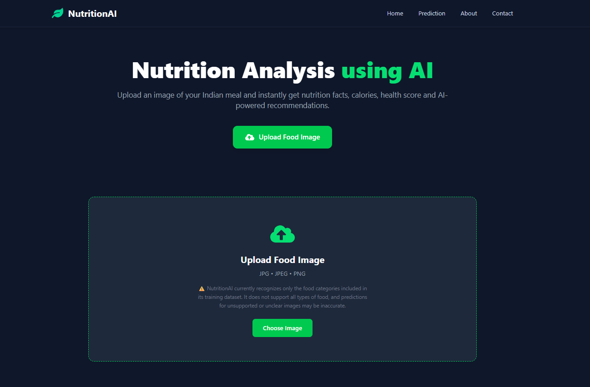
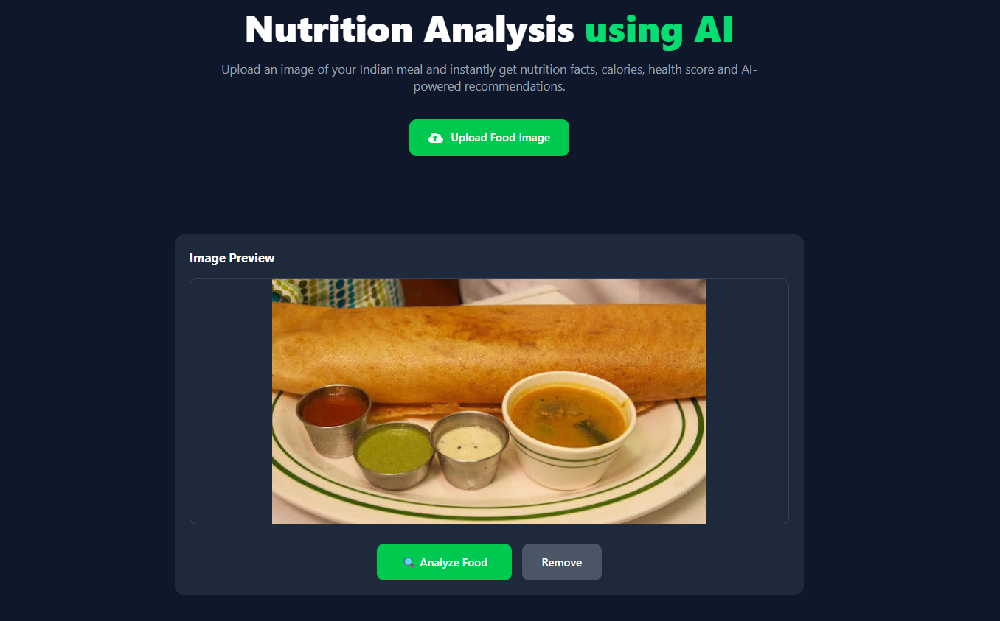
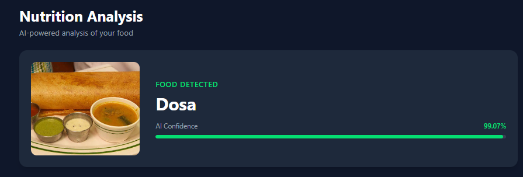
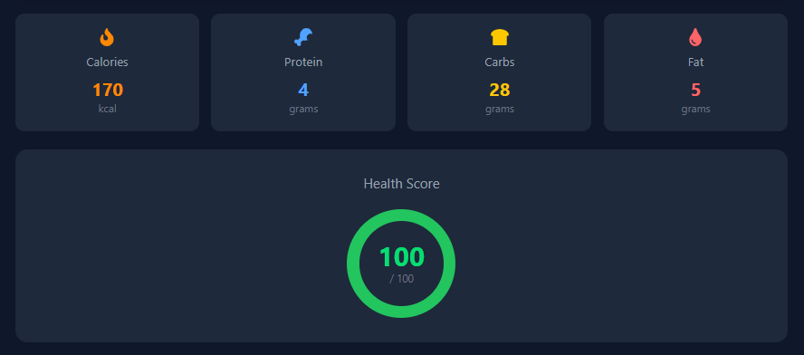
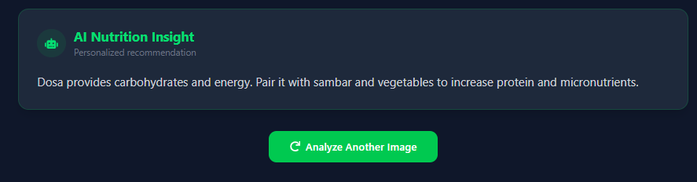
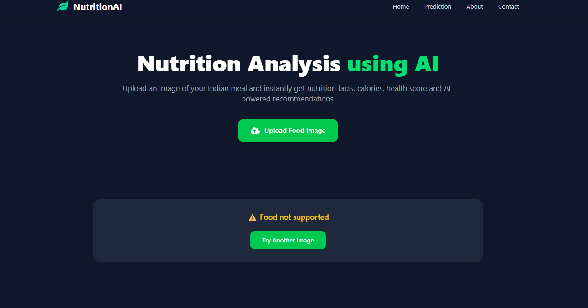

# 🍽️ NutritionAI

## AI-Powered Indian Food Recognition and Nutrition Analysis

NutritionAI is an AI-powered web application that identifies Indian food from an uploaded image and provides nutritional information, a health score, and an AI-generated nutrition recommendation.

The project combines a deep learning image classification model with a FastAPI backend and a React frontend to provide an end-to-end food analysis experience.

---

## ✨ Features

* 🖼️ Food image upload
* 🤖 AI-based food classification
* 📊 Prediction confidence score
* 🔥 Calories information
* 💪 Protein information
* 🍞 Carbohydrates information
* 💧 Fat information
* 💚 Health score
* 🤖 AI nutrition recommendation
* ⚠️ Unsupported food handling
* 🔄 Analyze another image
* 📱 Responsive user interface

---


## 📸 Screenshots

### 🏠 Home Page



### 🖼️ Food Image Upload



### 🤖 Food Prediction



### 📊 Nutrition Analysis



### 💚 AI Nutrition Recommendation



### ⚠️ Unsupported Food



---

## 🍛 Supported Food Categories

The current model supports **20 Indian food categories**:

* Aloo Matar
* Besan Cheela
* Biryani
* Chapathi
* Chole Bature
* Dahl
* Dhokla
* Dosa
* Gulab Jamun
* Idli
* Jalebi
* Kadai Paneer
* Naan
* Paani Puri
* Pakoda
* Pav Bhaji
* Poha
* Rolls
* Samosa
* Vada Pav

> ⚠️ **Disclaimer:** The model is trained only on the food categories listed above. It does not recognize all types of food. Predictions for unsupported foods or unclear images may be inaccurate.

---

## 🛠️ Technologies Used

### Frontend

* React
* Vite
* JavaScript / JSX
* Tailwind CSS
* React Icons

### Backend

* Python
* FastAPI
* Uvicorn
* TensorFlow / Keras
* NumPy
* Pillow

### Machine Learning

* Deep Learning
* Image Classification
* TensorFlow / Keras

---

## 📊 Dataset

The project uses the **Indian Food Image Dataset** from Kaggle.

**Dataset:** [Indian Food Image Dataset](https://www.kaggle.com/datasets/bhavikjikadara/indian-food-image-dataset)

The dataset contains images of Indian food categories used for training the food classification model.

---

## 🧠 Model

The application uses a TensorFlow/Keras image classification model trained to recognize the 20 supported food categories.

The trained model is stored at:

```text
backend/model/best_food_model.keras
```

The model provides the predicted food category and its confidence score. The prediction is then used to display nutritional information, a health score, and a nutrition recommendation.

---

## 🧪 Testing

A preliminary functional test was conducted using one test image from each of the 20 supported food categories.

All 20 test images were correctly classified during this preliminary test.

> This test represents functional validation using a small sample and should not be considered 100% overall model accuracy. A larger independent test set is required for formal accuracy evaluation.

---

## 🚀 How to Run

### Backend

Navigate to the backend directory:

```bash
cd backend
```

Create a virtual environment:

```bash
python -m venv venv
```

Activate the virtual environment.

**Windows:**

```bash
venv\Scripts\activate
```

Install dependencies:

```bash
pip install -r requirements.txt
```

Start the backend:

```bash
uvicorn main:app --reload
```

---

### Frontend

Open another terminal:

```bash
cd frontend
```

Install dependencies:

```bash
npm install
```

Start the development server:

```bash
npm run dev
```

Open the URL provided by Vite in your browser.

---

## 📁 Project Structure

```text
NutriVision-AI/
│
├── backend/
├── dataset/
├── frontend/
├── notebooks/
├── train_model.py
├── .gitignore
└── README.md
```

---

## ⚠️ Important Disclaimer

NutritionAI is an educational and project-based food recognition and nutrition analysis system.

The model currently supports only the 20 food categories listed above. Nutritional values, health scores, and recommendations are estimates intended for informational purposes only and should not be considered professional medical, nutritional, or dietary advice.

---

## 🔮 Future Scope

* Expand the number of supported food categories
* Improve model accuracy and generalization
* Add portion-size estimation
* Improve nutritional estimation
* Add personalized dietary recommendations
* Add food analysis history
* Deploy the application to the cloud

---

## 👩‍💻 Project Status

**Status: Functional Prototype**

The core food classification, nutrition analysis, health scoring, recommendation system, frontend, and backend integration have been implemented and tested.
